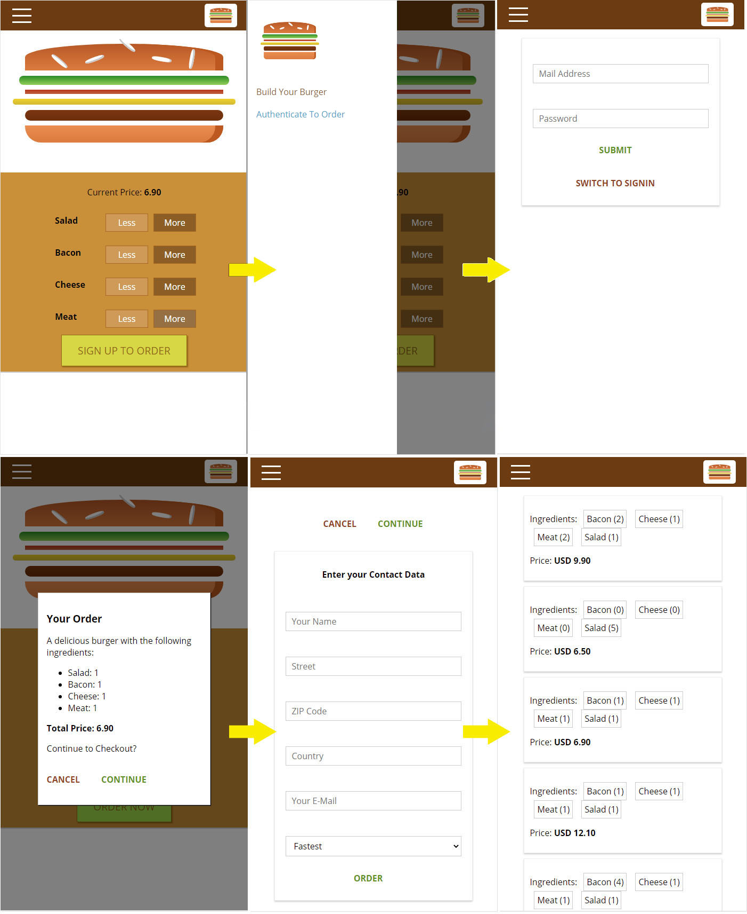

# My training project "The Burger Builder" on ReactJS library

> User can build his/her burger from different ingredients, signup or signin, get the price, make the order and fetch the history of user's orders.
> Redux library, Axios HTTP client, Routing, Google Firebase for backend was applied.
> 
